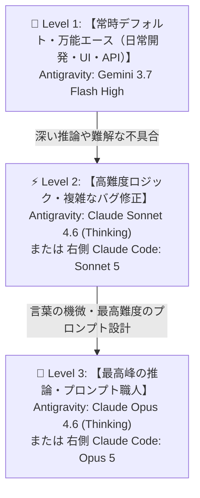

# 覚える君 プロジェクト：AIモデル＆ツール使い分けガイドライン

このドキュメントは、「覚える君」プロジェクトの開発効率・品質・コストパフォーマンスを最大化するために、**Antigravity 内のAIモデル** および **Claude Code 拡張機能（Sonnet 5 / Opus 5）** をどのように組み合わせ・切り替えるかの指針です。

AIエージェント側からも作業内容に応じて「**ここはAntigravityのGemini 3.7 Flash Highで進めます**」「**ここは右側のClaude Codeチャットを立ち上げてSonnet 5 / Opus 5を使ってください**」と具体的に指定・ナビゲートします。

---

## ⚠️ 【重要ルール】コード内モデルIDの絶対指定規則

アプリコード（`lib/anthropic.ts` 等）で APIモデルIDを指定・書き換える時は、**必ず以下の3つのいずれか**を正確に使用すること。**それ以外の文字列は絶対に書いてはならない。**

| 役割 | 記述する絶対モデルID | 用途 |
|---|---|---|
| **爆速（Haiku）** | `claude-haiku-4-5-20251001` | 採点・ツッコミ・ミニ課題・通常会話の爆速レスポンス（1〜2秒） |
| **高精度（Sonnet）** | `claude-sonnet-5` | 高度な文章生成・ニュアンス重視の回答生成 |
| **最高峰（Opus）** | `claude-opus-5` | 非常に複雑な推論・思考が必要な場合 |

---

## 1. 開発環境の階層とモデル分担（3.7 時代）

---

## 2. タスク別の推奨指定マップ

### 🚀 Level 1: 常時デフォルト・万能エース（日常開発・UI・API）
👉 **推奨指定: Antigravity `Gemini 3.7 Flash High`**
- **位置づけ**: 普段の開発のメインマシン（開発の8〜9割はこれでOK）
- **メリット**: 爆速（Fast）＋ Web開発/コーディング能力が大幅進化 ＋ 利用枠（クォータ）の消費が最も軽い
- **作業内容**:
  - 新機能追加・画面UI（Tailwind/CSS）の作成・レイアウト調整
  - APIルート（`/api/auth`, `/api/extract` 等）の作成・連携
  - ビルド検証（`npm run build`）、一般的なデバッグ、ドキュメント作成

---

### ⚡ Level 2: 高難度ロジック・複雑なバグ修正（準主力）
👉 **推奨指定: Antigravity `Claude Sonnet 4.6 (Thinking)`** または **Claude Codeチャット `Sonnet 5`**
- **位置づけ**: Gemini 3.7 で手こずる難解な課題や、深い思考が必要な場面の強力な助っ人
- **作業内容**:
  - 複雑な状態管理（Zustand / React Context）や非同期処理が絡む難解なバグ修正
  - 複雑なアルゴリズムや厳密なデータ変換処理の実装
  - 特定ファイルのピンポイント高速リファクタリング

---

### 👑 Level 3: 最高峰の推論・プロンプト職人（切り札・最終兵器）
👉 **推奨指定: Antigravity `Claude Opus 4.6 (Thinking)`** または **Claude Codeチャット `Opus 5`**
- **位置づけ**: AI界最高峰の推論力・日本語のニュアンス理解が求められる最重要タスク
- **作業内容**:
  - **「関西弁ツッコミ」「採点ロジック」などのプロンプト極限チューニング**（人間味・ユーモア・的確な言葉選び）
  - アプリ全体の超大規模なアーキテクチャ再設計・根本的な設計見直し
  - 難解なプロンプトの厳密な推敲

---

## 3. モデル・ツール指示の運用ルール

1. **基本は Antigravity の `Gemini 3.7 Flash High` で進める**
   - 普段は左上のモデルを `Gemini 3.7 Flash High` に設定したままで作業を開始します。

2. **Claude（Sonnet / Opus）が必要な場合のAIナビゲーション**:
   - プロンプトの細かなニュアンス調整や難関バグ修正など、Claude の力が必要なタスクに入る際、AIエージェント側から以下のように具体的にアナウンスします：
     > 「この作業はプロンプトの細かなニュアンス調整（または難解なロジック修正）が含まれるため、**Antigravityのモデルを `Claude Sonnet 4.6 (Thinking)` / `Claude Opus 4.6 (Thinking)` に切り替えるか**、あるいは **右側のClaude Codeパネルでチャットを立ち上げて `Sonnet 5` / `Opus 5` を使って** 指示を出してください。」

3. **操作方法**:
   - **Antigravity で作業する場合**: 左上のモデルドロップダウンで選択
   - **Claude Code で作業する場合**: 右側パネルで新しいチャットを立ち上げ、モデル欄で `Sonnet 5` または `Opus 5` を選択して作業指示

---

## 4. 🤖 AIエージェントの行動規範（最新情報の確認義務）

1. **古い知識・思い込みによるモデル提示の完全禁止**:
   - 過去の学習データに基づいた古いモデル名（Claude 3.5 Sonnetや旧Gemini等）を勝手に提案してはならない。
   - モデル名やAPI仕様に少しでも更新の可能性がある場合は、必ず `search_web` や本ドキュメントを参照して最新情報を確認すること。
2. **常に最新のモデル環境・API環境を前提に提案すること**:
   - Antigravity 側のモデル（`Gemini 3.7 Flash High`, `Claude Sonnet 4.6 (Thinking)`, `Claude Opus 4.6 (Thinking)`）および Claude Code 側の最新モデル（`Sonnet 5`, `Opus 5`）を正しく案内すること。

